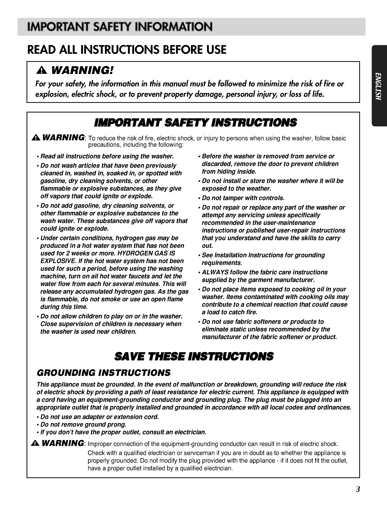
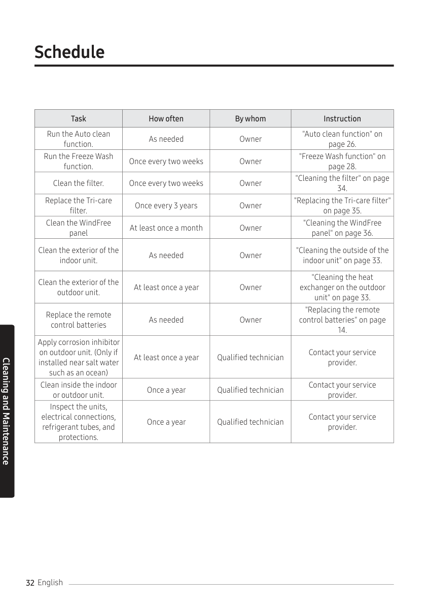
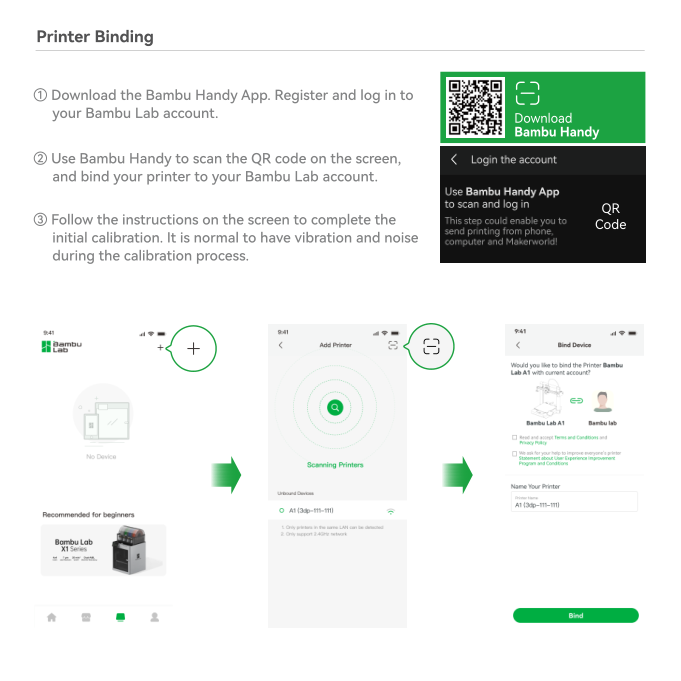

# Visual Examples: PDF → Markdown

Three real-world pages showing what OrangeD extracts, how it routes, and where it hits its limits.

---

## Example 1: Text-Heavy Safety Page (LG Washer, Page 3)

**Route decision:** `ICON_SNIPER` (low text density relative to page data, image present)
**Source:** LG 3828ER3052K Washing Machine Manual

### Original Page



### Extracted Markdown (snippet)

```markdown
# IMPORTANT SAFETY INFORMATION
# READ ALL INSTRUCTIONS BEFORE USE
# WARNING!

For your safety, the information in this manual must be followed to minimize
the risk of fire or explosion, electric shock, or to prevent property damage,
personal injury, or loss of life.

# IMPORTANT SAFETY INSTRUCTIONS

WARNING: To reduce the risk of fire, electric shock, or injury to persons when
using the washer, follow basic precautions, including the following:

? Read all instructions before using the washer.
? Do not wash articles that have been previously cleaned in, washed in,
  soaked in, or spotted with gasoline, dry cleaning solvents, or other
  flammable or explosive substances...

# SAVE THESE INSTRUCTIONS
# GROUNDING INSTRUCTIONS

This appliance must be grounded. In the event of malfunction or breakdown,
grounding will reduce the risk of electric shock...
```

### What was recovered

- **4 heading levels** correctly identified from font sizes: "IMPORTANT SAFETY INFORMATION", "WARNING!", "IMPORTANT SAFETY INSTRUCTIONS", "GROUNDING INSTRUCTIONS", "SAVE THESE INSTRUCTIONS"
- **Breadcrumb navigation** injected (`<!-- GROUNDING INSTRUCTIONS -->`)
- **Bullet points** preserved (shown as `?` — the original PDF uses a custom bullet glyph that maps to `?` in the font encoding)
- **Reading order** maintained across the dual-section layout
- **Header/footer** stripped (page number "3" removed)

### What's missing or imperfect

- The `?` bullet character is a CID mapping artifact — the PDF uses a non-standard glyph for bullets. A post-processing rule could normalize this to `-` or `*`.
- The warning triangle icon (⚠) at the top is not transcribed — it's an embedded image, not text.
- Some line breaks within paragraphs are preserved from the PDF's physical layout rather than being reflowed into natural paragraphs.

---

## Example 2: Maintenance Schedule Table (Samsung AR9500T, Page 32)

**Route decision:** `TABLE_RESCUE` (complex table detected, no images, high short-line ratio)
**Source:** Samsung AR9500T Wind-Free Air Conditioner Manual

### Original Page



### Extracted Markdown

```markdown
# Schedule

TaskHow oftenBy whomInstruction
Run the Auto clean function.As neededOwner"Auto clean function" on page 26.
Run the Freeze Wash function.Once every two weeksOwner"Freeze Wash function" on page 28.
Clean the filter.Once every two weeksOwner"Cleaning the filter" on page 34.
Replace the Tri-care filter.Once every 3 yearsOwner"Replacing the Tri-care filter" on page 35.
Clean the WindFree panelAt least once a monthOwner"Cleaning the WindFree panel" on page 36.
...
```

### What was recovered

- **Section heading** "Schedule" correctly identified as H1
- **All text content** from the table is extracted — every task, frequency, responsible party, and cross-reference
- **Reading order** is correct (top-to-bottom, left-to-right within each row)

### What's missing or imperfect

- **Table structure is lost.** The 4-column table (Task / How often / By whom / Instruction) is extracted as concatenated text per row, not as a Markdown table with `|` separators. This is because PyMuPDF's native text extraction doesn't preserve table cell boundaries — it returns text blocks in reading order.
- **This is exactly why `TABLE_RESCUE` exists.** The router correctly identified this page as needing VLM-based table repair. With an OCR adapter (PaddleOCR or Gemini) enabled, this page would be sent to the VLM for proper table reconstruction.
- The page footer "English" and page number "32" leaked through the header/footer filter (they're positioned within the content zone).

### What it would look like with an OCR adapter

With a VLM adapter enabled, the same page would produce:

```markdown
| Task | How often | By whom | Instruction |
| :--- | :--- | :--- | :--- |
| Run the Auto clean function | As needed | Owner | "Auto clean function" on page 26 |
| Run the Freeze Wash function | Once every two weeks | Owner | "Freeze Wash function" on page 28 |
| Clean the filter | Once every two weeks | Owner | "Cleaning the filter" on page 34 |
| ... | ... | ... | ... |
```

---

## Example 3: Image-Only Page (Bambu Lab A1, Page 19)

**Route decision:** `FULL_VLM` (text length = 8 chars, 5 images detected)
**Source:** Bambu Lab A1 3D Printer Quick Start Guide

### Original Page



### Extracted Markdown

```markdown
[Image on page 19, position: bottom]
[Image on page 19, position: top]
QRCode
```

### What was recovered

- **Image placeholders** registered with position hints (top/bottom)
- **"QRCode"** — the only native text on the page (a label near the QR code)
- The router correctly classified this as `FULL_VLM`

### What's missing

- **Everything.** This page's content is entirely visual: app screenshots, QR code, step-by-step illustrated instructions for "Printer Binding." None of this exists as extractable text in the PDF — it's all rendered as images.
- Native extraction correctly reports near-zero output rather than hallucinating content.

### What it would look like with an OCR adapter

With a Qwen-VL or Gemini adapter, the same page would produce something like:

```markdown
## Printer Binding

1. Download the Bambu Handy App. Register and log into your Bambu Lab account.
2. Use Bambu Handy to scan the QR code on the printer and bind your printer
   to your Bambu Lab account.
3. The printer will automatically run a self-check and calibration upon
   initial calibration. It is normal to hear vibration and noise...
```

This is the intended workflow: OrangeD's native path extracts what's extractable,
the router identifies what needs help, and the adapter fills the gap.

---

## Summary

| Example | Page Type | Route | Native Output | With Adapter |
|:---|:---|:---|:---|:---|
| LG Safety | Text-heavy, warnings | ICON_SNIPER | ~3,400 chars, headings recovered | Would add icon descriptions |
| Samsung Schedule | 4-column table | TABLE_RESCUE | Text extracted but table structure lost | Would reconstruct proper Markdown table |
| Bambu Lab Binding | Image-only instructions | FULL_VLM | 3 lines (placeholders only) | Would extract full step-by-step instructions |

**The native path is the floor, not the ceiling.** These examples show that OrangeD honestly reports what it can extract natively, correctly routes pages that need more help, and provides a clean adapter interface for plugging in the appropriate OCR/VLM backend.
